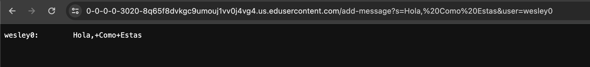

# Lab Report 2
## Part 1

Code for the ChatServer:
```java
import java.io.IOException;
import java.net.URI;

class Handler implements URLHandler {
    String currString = "";

    public String handleRequest(URI url) {
        if (url.getPath().equals("/")) {
            return String.format(currString);
        } else {
            if (url.getPath().contains("/add-message")) {
                String[] parameters = url.getQuery().split("&");
                String[] a = parameters[0].split("=");
                String[] b = parameters[1].split("=");
                if (a[0].equals("s") && b[0].equals("user")) {
                    currString += b[1] + ":\t" + a[1] + "\n";
                }
                return String.format(currString);
            }
            return "404 Not Found!";
        }
    }
}

class ChatServer {
    public static void main(String[] args) throws IOException {
        if(args.length == 0){
            System.out.println("Missing port number! Try any number between 1024 to 49151");
            return;
        }

        int port = Integer.parseInt(args[0]);

        Server.start(port, new Handler());
    }
}
```
While I do not use multiple methods in my code, I can describe the values of all intermediary variables I used for each image.

After this url is visited, **handleRequest** method is run with the given url \
```0.0.0.0:3020/add-message?s=Hola, Como Estas&user=wesley0``` \
Afterwards, since the path is not simply /, the code enters the else section of the first if-else statement. Then, since the path is /add-message, it enters the if section of the 2nd if-else statement. We first split by the "&" character as to split our two parameters apart so we can get each of their values individually, thus parameters becomes an array of two strings:
```parameters = ["s=Hola, Como Estas", "user=wesley0]"```\
After that, we split each string in parameters along the "=" character to split the query paramater from its value, so we get ```a = ["s", "Hola, Como Estas"]``` and ```b = ["user", "wesley0"]```
We then check that both parameters are correct, ie first parameter is s, second parameter is user, and if this is ture, we concactenate the string currString we track with a formatted version of our two parameter values from s and user.

In this case, our value that we track **currString** changes from empty string "" to "wesley0:\tHola,+Como+Estas\n"


After this url is visited  **handleRequest** method is run with the given url \
```0.0.0.0:3020/add-message?s=Hola, Estoy Bien&user=wesley1``` \
Afterwards, since the path is not simply /, the code enters the else section of the first if-else statement. Then, since the path is /add-message, it enters the if section of the 2nd if-else statement. We first split by the "&" character as to split our two parameters apart so we can get each of their values individually, thus parameters becomes an array of two strings:
```parameters = ["s=Hola, Estoy Bien", "user=wesley1]"```\
After that, we split each string in parameters along the "=" character to split the query paramater from its value, so we get ```a = ["s", "Hola, Estoy Bien"]``` and ```b = ["user", "wesley1"]```
We then check that both parameters are correct, ie first parameter is s, second parameter is user, and if this is ture, we concactenate the string currString we track with a formatted version of our two parameter values from s and user.

In this case, our value that we track **currString** changes from string "wesley0:\tHola,+Como+Estas\n" to "wesley0:\tHola,+Como+Estas\nwesley1:\tHola,+Estoy+Bien\n"

## Part 2

**Path for private key on my personal computer:**


\
**Path for public key on the ieng6 file system:**


\
**Screenshot of logging in to ieng6 using ssh without a password:**


## Part 3
For this lab, I learned a lot about using ssh keys to making logging into remote servers easier. I had done something similar before with github but this makes the process and what is happening when doing it make a lot more sense rather than copying commands from a guide.