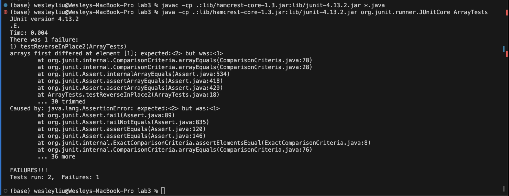

# Lab 3 Report
## Part 1

For this lab I chose method ```reverseInPlace```

Here is the failiure inducing input for ```reverseInPlace```:
```java
@Test 
public void testReverseInPlace2() {
    int[] input1 = {2, 1 };
    ArrayExamples.reverseInPlace(input1);
    assertArrayEquals(new int[]{1, 2}, input1);
}
```
Here is an input that does not induce failiure ```reverseInPlace```:
```java
@Test 
    public void testReverseInPlace() {
    int[] input1 = { 3 };
    ArrayExamples.reverseInPlace(input1);
    assertArrayEquals(new int[]{ 3 }, input1);
}
```
Here is a screenshot of running these tests, demonstrating the symptom of our error that the output of running 
```java
reverseInPlace([1,2])
```
gives us output ```[1,1]```


Here is the before and after code changes that were required to fix this bug: \
**Before**:
```java
static void reverseInPlace(int[] arr) {
    for(int i = 0; i < arr.length; i += 1) {
      arr[i] = arr[arr.length - i - 1];
    }
}
```
**After**:
```java
static void reverseInPlace(int[] arr) {
    int half = arr.length/2;
    for(int i = 0; i < half; i += 1) {
      int store = arr[i];
      arr[i] = arr[arr.length - i - 1];
      arr[arr.length - i - 1] = store;
    }
}
```
The bug is that the code does not store the value that is replaced in any way, so instead of swapping the values of the two indices in a manner like flipping the array, we instead overwrite the first half of the array with values from the latter half, and when the for loop reaches the 2nd half of the array it copies over values from the 1st half of the array, but these values are no longer the original 1st values of the array but instead what was originally in the 2nd half, thus losing the original data. To fix this, we need to write some code to swap the numbers instead of overwriting values, done inside the for loop by creating temporary variable ```store``` and ```store = arr[i]```. We then set ```arr[i] = arr[arr.length - i - 1]```, or the index that it is opposite to, and finally we set ``` arr[arr.length - i - 1] = store```, or the original value of ```arr[i]```  Also, make sure to only run the loop on half of the array, as if you ran it on the full array you would be flipping the array twice, i.e. doing nothing.

## Part 2

For this part I want to look at ```grep```. I found out mostly about this command from this site: "https://pubs.opengroup.org/onlinepubs/7908799/xcu/grep.html" \
\
**-E**:
This option allows ```grep``` to use extended regular expressions over regular expressions to add more detailed searching.

For example:
```
wesleyliu@Wesleys-MacBook-Pro docsearch % grep -E t{2} technical/911report/chapter-1.txt
    For those heading to an airport, weather conditions could not have been better for a safe and pleasant journey. Among the travelers were Mohamed Atta and Abdul Aziz al Omari, who arrived at the airport in Portland, Maine.
    Boston: American 11 and United 175. Atta and Omari boarded a 6:00 A.M. flight from Portland to Boston's Logan International Airport.
    When he checked in for his flight to Boston, Atta was selected by a computerized prescreening system known as CAPPS (Computer Assisted Passenger Prescreening System), created to identify passengers who should be subject to special security measures. Under security rules in place at the time, the only consequence of Atta's selection by CAPPS was that his checked bags were held off the plane until it was confirmed that he had boarded the aircraft. This did not hinder Atta's plans.
    Atta and Omari arrived in Boston at 6:45. Seven minutes later, Atta apparently took a call from Marwan al Shehhi, a longtime colleague who was at another terminal at Logan Airport. They spoke for three minutes.
    ...
```
The ERE we use here is ```t{2}``` which filters for all lines with strings that have 2 copies of t right after each other, or ```"tt"```. These lines all follow this as they have the name "Atta" in them.

Another example can be this:
```
wesleyliu@Wesleys-MacBook-Pro docsearch % grep -E "airp*" technical/911report/chapter-1.txt
    For those heading to an airport, weather conditions could not have been better for a safe and pleasant journey. Among the travelers were Mohamed Atta and Abdul Aziz al Omari, who arrived at the airport in Portland, Maine.
    When he checked in for his flight to Boston, Atta was selected by a computerized prescreening system known as CAPPS (Computer Assisted Passenger Prescreening System), created to identify passengers who should be subject to special security measures. Under security rules in place at the time, the only consequence of Atta's selection by CAPPS was that his checked bags were held off the plane until it was confirmed that he had boarded the aircraft. This did not hinder Atta's plans.
    While Atta had been selected by CAPPS in Portland, three members of his hijacking team-Suqami, Wail al Shehri, and Waleed al Shehri-were selected in Boston. Their selection affected only the handling of their checked bags, not their screening at the checkpoint. All five men cleared the checkpoint and made their way to the gate for American 11. Atta, Omari, and Suqami took their seats in business class (seats 8D, 8G, and 10B, respectively). The Shehri brothers had adjacent seats in row 2 (Wail in 2A, Waleed in 2B), in the firstclass cabin. They boarded American 11 between 7:31 and 7:40. The aircraft pushed back from the gate at 7:40.
    Shehhi and his team, none of whom had been selected by CAPPS, boarded United 175 between 7:23 and 7:28 (Banihammad in 2A, Shehri in 2B, Shehhi in 6C, Hamza al Ghamdi in 9C, and Ahmed al Ghamdi in 9D). Their aircraft pushed back from the gate just before 8:00.
    Washington Dulles: American 77. Hundreds of miles southwest of Boston, at Dulles International Airport in the Virginia 
    ...
    First, the Langley pilots were never briefed about the reason they were scrambled. As the lead pilot explained, "I reverted to the Russian threat. . . . I'm thinking cruise missile threat from the sea. You know you look down and see the Pentagon burning and I thought the bastards snuck one by us. . . . [Y]ou couldn't see any airplanes, and no one told us anything." The pilots knew their mission was to divert aircraft, but did not know that the threat came from hijacked airliners.
    ...
```
Where we use wildcard operations in ```"airp*"``` to filter for both "airplane" and "airport" in each line.

**-c**:
This option allows us to see the # of lines that matches out search criteria rather than printing every line out. 

For example:
```
wesleyliu@Wesleys-MacBook-Pro docsearch % grep -c "United 175" technical/911report/chapter-1.txt
20
```
There are 20 occurances of "United 175" in the text, thus the -c option returns the value 20 instead of all 20 lines.

We can do this similarly with text files, like so:
```
wesleyliu@Wesleys-MacBook-Pro docsearch % find technical | grep ".txt" | grep -c "journal"
102
```
We first use ```find technical``` to gather the names of all files and directories, then we use a pipe operator into ```grep ".txt"``` to get all .txt files. Then finally, we pipe that output into ``` grep -c "journal"``` to find the number of files with "journal" in their filenames. This number is eventually 102.

**-v**:
This option inverts our filter, only filtering lines that do not match up with our filters. Here is an example:

```
wesleyliu@Wesleys-MacBook-Pro docsearch % find technical | grep -v ".txt"                 
technical
technical/government
technical/government/About_LSC
technical/government/Env_Prot_Agen
technical/government/Alcohol_Problems
technical/government/Gen_Account_Office
technical/government/Post_Rate_Comm
technical/government/Media
technical/plos
technical/biomed
technical/911report
```
This example first does ```find technical``` again to get all file or directory names in the technical directory. Then, it pipes this result into command ```grep -v ".txt"```, which will give us all files/directory paths that do not have ```.txt``` in their filename. Since all files are .txt files, it simply shows us all directory paths.


Here is a 2nd example:
```
wesleyliu@Wesleys-MacBook-Pro docsearch % find technical | grep -v "biomed"
technical
technical/government
technical/government/About_LSC
technical/government/About_LSC/LegalServCorp_v_VelazquezSyllabus.txt
...
technical/plos
technical/plos/pmed.0020273.txt
technical/plos/journal.pbio.0030032.txt
...
technical/911report
technical/911report/chapter-13.4.txt
technical/911report/chapter-13.5.txt
...
```
This example takes all file and directory names from ```find technical``` and pipes them into ```grep -v "biomed"```. Normally without the -v option this would display all file paths with the string "biomed", ie all of the files in the biomed directory. But, in our case, it displays all files and directory paths but the ones in directory biomed.

**-i**:
This option does the standard pattern matching but now ignores cases, so it will consider "A" and "a" the same

Here is the first example:
```
wesleyliu@Wesleys-MacBook-Pro docsearch % find technical/government/About_LSC | grep -i "Com" 
technical/government/About_LSC/Comments_on_semiannual.txt
technical/government/About_LSC/commission_report.txt
```

In this directory, ```technical/government/About_LSC``` there are two files ```Comments_on_semiannual.txt``` and ```commission_report.txt```. Both of these files start with "com" but with different cases as one has a capitalized C and the other one does not, so normally with our search string "Com" we would usually only get ```Comments_on_semiannual.txt```. But, with the -i we ignore the uppercase on the C and we are able to get both files as our output.

Here is a second example:
```
wesleyliu@Wesleys-MacBook-Pro docsearch % find technical/government/About_LSC | grep -i "CoN"
technical/government/About_LSC/Special_report_to_congress.txt
technical/government/About_LSC/CONFIG_STANDARDS.txt
technical/government/About_LSC/conference_highlights.txt
```

In this directory there are three files that have the letters "con", but none of them have the exact casing we gave for our filter string "CoN". Normally this set of commands would give us none of the files listed, but here it returns to us all three due to the -i option.